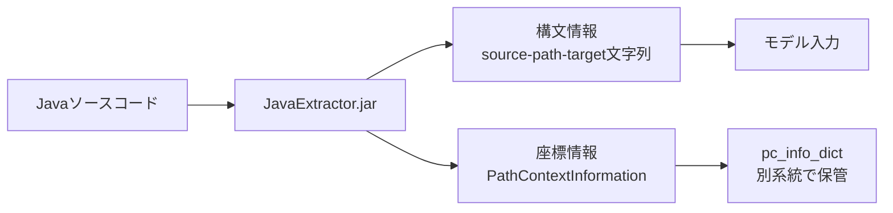
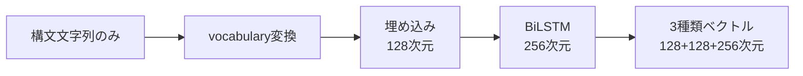
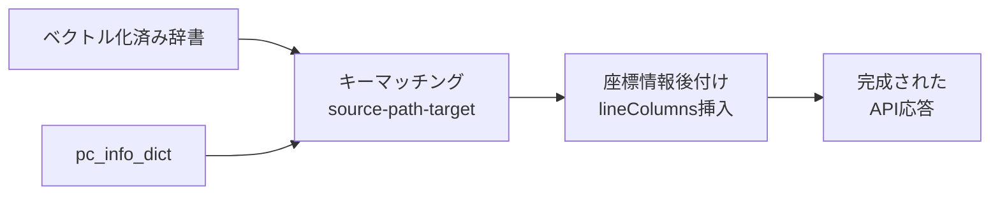
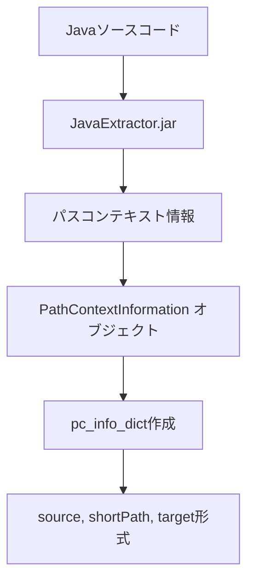
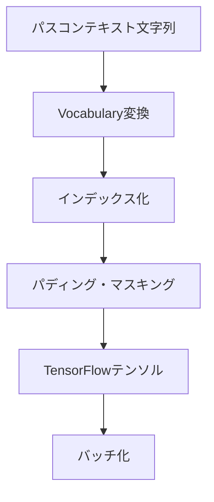
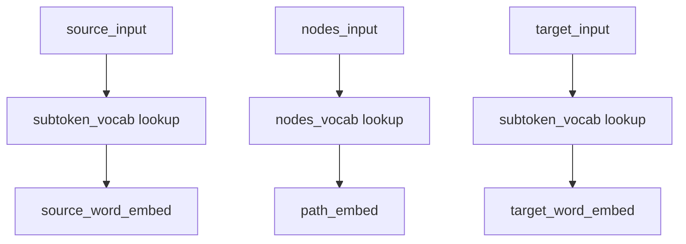
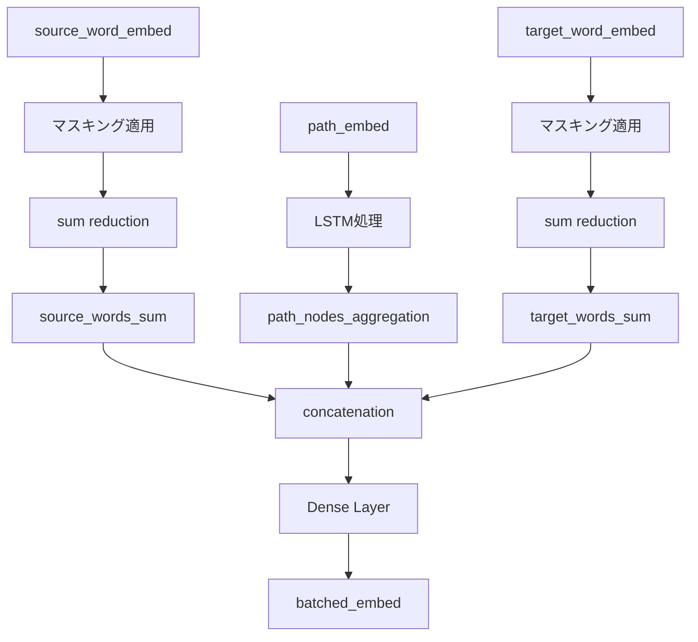
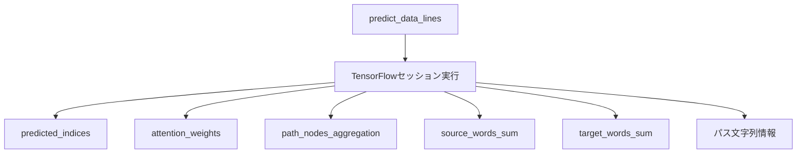
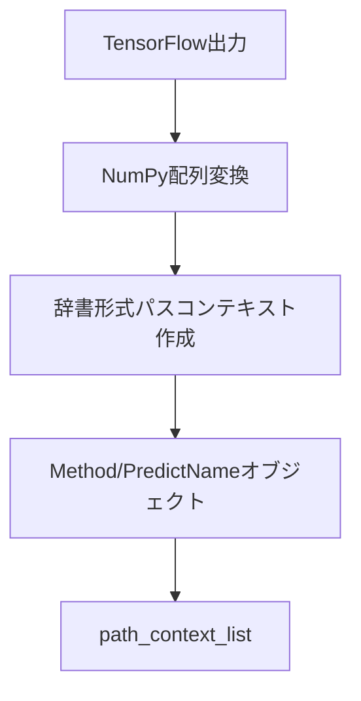
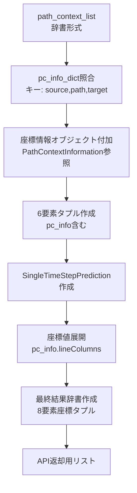

# code2seq ベクトル生成システム

## 概要

code2seqシステムは、Javaソースコードから4種類のベクトル表現を生成するニューラルネットワークベースのシステムです。このドキュメントでは、各コンポーネントがどのように連携してベクトルを生成するかを詳細に説明します。

## 生成されるベクトルの種類

システムは以下の3種類のベクトルを生成し、API互換性のため4つのフィールドで返します：

### 実際に生成される3種類
1. **source_vector**: shape=(128,) - ソース単語埋め込みの集約（EMBEDDINGS_SIZE）
2. **target_vector**: shape=(128,) - ターゲット単語埋め込みの集約（EMBEDDINGS_SIZE）  
3. **path_nodes_aggregation**: shape=(256,) - BiLSTMによるASTパス抽象化（RNN_SIZE）

### API返却時の4フィールド
- **source_vector**: 上記の`source_vector`
- **target_vector**: 上記の`target_vector` 
- **vector**: `path_nodes_aggregation`の**複製**
- **astpath_vector**: `path_nodes_aggregation`の**複製**

**重要な事実**: `vector`と`astpath_vector`は完全に同一データです（model.py:1073-1082で確認）。

## データフローの3段階抽象化

システム全体のデータ処理は以下の3つの抽象段階で構成されています：

### 段階1: ソースコード解析と情報分離
**目的**: ソースコードから**構文情報**と**座標情報**を完全分離



- **構文情報**: `source-path-target` 文字列（例: `"int,Prim0|Mth|Nm1,METHOD_NAME"`）
- **座標情報**: 8要素座標タプル（例: `(1,4,1,7,1,12,1,15)`）
- **完全分離**: 2つの情報は独立したデータ構造で並行処理される
- **実装**: `extractor.py` → 文字列リスト + `pc_info_dict` 辞書

### 段階2: 構文情報のベクトル化処理  
**目的**: 構文文字列のみをニューラルネットワークで数値ベクトルに変換



- **入力**: 構文文字列のみ（座標情報は完全に切り離される）
- **処理**: vocabulary → embedding(128) → BiLSTM(256) → 集約
- **出力**: 実際は3種類（source_vector, target_vector, path_nodes_aggregation）
- **重要**: `vector`と`astpath_vector`は`path_nodes_aggregation`の複製

### 段階3: 座標情報との統合
**目的**: ベクトル化後に分離保管されていた座標情報を後付け統合



- **キーマッチング**: `(source, path, target)` の三要素でpc_info_dictを検索
- **後付け統合**: ベクトル辞書に`lineColumns`フィールドを追加
- **デフォルト値**: マッチしない場合は`[0,0,0,0,0,0,0,0]`を設定
- **実装**: `model.py` → `common.py` → `interactive_predict.py`

---

## システムアーキテクチャ（詳細）

### 主要コンポーネント

| コンポーネント | ファイル                 | 主要クラス・関数                            | 役割                     |
| -------------- | ------------------------ | ------------------------------------------- | ------------------------ |
| Web API        | `flask_app.py`           | `process_data()`, `initialize_predictor()`  | HTTPエンドポイント提供   |
| 予測器         | `interactive_predict.py` | `InteractivePredictor`, `get()`             | 全体フロー統制           |
| 抽出器         | `extractor.py`           | `Extractor`, `extract_paths()`              | パスコンテキスト抽出     |
| モデル         | `model.py`               | `Model`, `predict()`, `compute_contexts()`  | TensorFlowベクトル生成   |
| データ変換     | `common.py`              | `parse_results()`, `PathContextInformation` | データ構造変換・処理     |
| データ読み込み | `reader.py`              | `Reader`, `process_from_placeholder()`      | TensorFlow用データ前処理 |

## ベクトル生成フロー（詳細6Phase）

上記の3段階抽象化を詳細に分解すると以下の6つのPhaseになります：

| Phase   | 抽象段階 | 処理内容                           | 実装場所                              |
| ------- | -------- | ---------------------------------- | ------------------------------------- |
| Phase 1 | 段階1    | パスコンテキスト抽出               | `extractor.py`                        |
| Phase 2 | 段階2    | TensorFlow前処理                   | `reader.py`                           |
| Phase 3 | 段階2    | ニューラルネットワークベクトル生成 | `model.py`                            |
| Phase 4 | 段階2    | TensorFlowセッション実行           | `model.py`                            |
| Phase 5 | 段階3    | データ構造変換                     | `model.py`                            |
| Phase 6 | 段階3    | 結果統合と返却                     | `common.py`, `interactive_predict.py` |

### Phase 1: パスコンテキスト抽出（段階1: 情報分離）

**場所**: `extractor.py`



**処理内容**:
- `Extractor.extract_paths(code_string)` → Javaコードから構文木パスを抽出
- `PathContextInformation(context)` オブジェクト作成（座標情報付き）
- `pc_info_dict[(pc_info.source, pc_info.shortPath, pc_info.target)] = pc_info`

**主要変数・プロパティ**:
- `pc_info.source` / `pc_info.target`: ソース・ターゲット単語
- `pc_info.shortPath` / `pc_info.longPath`: AST構文パス
- `pc_info.lineColumns`: 座標情報 (line, column)

### Phase 2: TensorFlow前処理（段階2: ベクトル化前処理）

**場所**: `reader.py`



**処理内容**:
- `Reader.process_from_placeholder()` → 文字列をvocabularyインデックスに変換
- `MAX_NAME_PARTS`、`MAX_PATH_LENGTH`に基づくパディング
- `valid_context_mask`生成

**主要変数・テンソル**:
- `PATH_SOURCE_INDICES_KEY`: ソース単語インデックス
- `NODE_INDICES_KEY`: ASTノードインデックス  
- `PATH_TARGET_INDICES_KEY`: ターゲット単語インデックス
- `VALID_CONTEXT_MASK_KEY`: 有効コンテキストマスク
- `PATH_SOURCE_LENGTHS_KEY` / `PATH_LENGTHS_KEY` / `PATH_TARGET_LENGTHS_KEY`: 長さ情報

### Phase 3: ニューラルネットワークベクトル生成（段階2: ベクトル化実行）

**場所**: `model.py`

#### 3.1 埋め込み生成



**埋め込みボキャブラリ**:
- `subtoken_vocab`: サブトークン埋め込み (EMBEDDINGS_SIZE次元)
- `nodes_vocab`: ASTノード埋め込み (EMBEDDINGS_SIZE次元)
- `target_words_vocab`: ターゲット語彙埋め込み

**TensorFlow変数名**:
- `model/SUBTOKENS_VOCAB`: shape=(subtoken_vocab_size, EMBEDDINGS_SIZE)
- `model/NODES_VOCAB`: shape=(nodes_vocab_size, EMBEDDINGS_SIZE)
- `model/TARGET_WORDS_VOCAB`: shape=(target_vocab_size, EMBEDDINGS_SIZE)

#### 3.2 ベクトル計算 (`compute_contexts`)



**詳細計算**:

1. **単語ベクトル (source_words_sum)**:
   ```python
   source_words_sum = tf.reduce_sum(
       input_tensor=source_word_embed * source_word_mask, axis=2
   )  # shape: (batch, max_contexts, dim)
   ```

2. **ASTパスベクトル (path_nodes_aggregation)**:
   ```python
   # LSTMによるパス抽象化
   path_nodes_aggregation = self.calculate_path_abstraction(
       path_embed, path_lengths, valid_mask, is_evaluating
   )  # shape: (batch, max_contexts, rnn_size)
   ```

3. **ターゲットベクトル (target_words_sum)**:
   ```python
   target_words_sum = tf.reduce_sum(
       input_tensor=target_word_embed * target_word_mask, axis=2
   )  # shape: (batch, max_contexts, dim)
   ```

4. **統合コンテキスト (batched_embed)**:
   ```python
   context_embed = tf.concat(
       [source_words_sum, path_nodes_aggregation, target_words_sum], axis=-1
   )  # shape: (batch, contexts, 128+256+128=512)
   batched_embed = tf.layers.dense(
       inputs=context_embed,
       units=DECODER_SIZE,  # 320次元（config.py:20で確認）
       activation=tf.nn.tanh
   )
   ```
   
   **重要**: この`batched_embed`は予測用の中間表現です。**API返却される`vector`は`path_nodes_aggregation`(256次元)です**。

### Phase 4: TensorFlowセッション実行（段階2: ベクトル化出力）

**場所**: `model.py` - `predict()`



**実行内容**:
```python
(predicted_indices, top_scores, true_target_strings, attention_weights,
 path_nodes_aggregation, source_words_sum, target_words_sum,
 path_source_string, path_strings, path_target_string) = self.sess.run([
    self.predict_top_indices_op,     # 予測インデックス
    self.predict_top_scores_op,      # 予測スコア  
    self.predict_target_strings_op,  # 実際のターゲット文字列
    self.attention_weights_op,       # アテンション重み
    self.path_nodes_aggregation_op,  # ASTパスベクトル (256次元)
    self.source_words_sum_op,        # 単語ベクトル (128次元)
    self.target_words_sum_op,        # ターゲットベクトル (128次元)
    self.predict_source_string,      # ソース文字列
    self.predict_path_string,        # パス文字列
    self.predict_path_target_string, # ターゲット文字列
], feed_dict={self.predict_placeholder: line})
```

**TensorFlowオペレーション名**:
- `self.predict_top_indices_op`: `build_test_graph()`で作成される予測op
- `self.attention_weights_op`: アテンションメカニズムの重み
- `self.path_nodes_aggregation_op`: LSTMベースのパス集約
- `self.source_words_sum_op` / `self.target_words_sum_op`: 単語埋め込み集約

### Phase 5: データ構造変換（段階3: ベクトル辞書化）

**場所**: `model.py` - `get_method()`



**辞書作成** (`Model.get_method()`):
```python
path_context_dict = {
    "source": Common.binary_to_string(source),           # ソース単語
    "path": Common.binary_to_string(path),               # AST構文パス
    "target": Common.binary_to_string(target),           # ターゲット単語
    "attention": weight.item(),                          # アテンション重み
    "vector": vector.tolist(),                           # ASTパスベクトル(256) ★path_nodes_aggregationと同一
    "source_vector": source_words_sum[i].tolist(),       # 単語ベクトル(128)
    "target_vector": target_words_sum[i].tolist(),       # ターゲットベクトル(128)
    "astpath_vector": path_nodes_aggregation[i].tolist(), # ASTパスベクトル(256) ★vectorと同一
}
```

**データ構造クラス**:
- `Method`: メソッド情報格納
- `PredictName`: 予測名とパスコンテキストリスト
- `predict_name.path_context_list`: 辞書形式のパスコンテキスト配列

### Phase 6: 結果統合と返却（段階3: 座標情報統合）

**場所**: `common.py` - `parse_results()` → `interactive_predict.py` - `get()`



**Step 1: 座標情報オブジェクト付加** (`Common.parse_results()`):
```python
# 辞書形式パスコンテキストから座標情報オブジェクトを取得
for path_context in predict_name.path_context_list:
    # source, path, targetからキーを生成してpc_info_dictを照合
    key = (
        path_context.get("source"),    # 例: "int"
        path_context.get("path"),      # 例: "Prim0|Mth|Nm1"
        path_context.get("target")     # 例: "METHOD_NAME"
    )
    
    if key in pc_info_dict:
        pc_info = pc_info_dict[key]  # PathContextInformation取得 ★座標情報付加
        current_timestep_paths.append((
            path_context.get("attention", 0.0),     # アテンション重み
            path_context.get("vector", []),         # コンテキストベクトル(256)
            pc_info,                                # 座標情報オブジェクト ★ここで参照を格納
            path_context.get("source_vector"),      # 単語ベクトル(128)
            path_context.get("target_vector"),      # ターゲットベクトル(128)
            path_context.get("astpath_vector"),     # ASTパスベクトル(256)
        ))
```

**Step 2: 座標値展開と最終統合** (`InteractivePredictor.get()`):
```python
# SingleTimeStepPredictionから6要素タプルを取得
single_timestep_prediction = method_prediction.predictions[0]
attention_paths = single_timestep_prediction.attention_paths  # 6要素タプルのリスト

# attention_pathsとmethod_info_listは1:1対応
assert len(attention_paths) == len(method_info_list)

# 最終結果辞書を作成（座標情報を実際の値に展開）
for attention_obj, pc_info in zip(attention_paths, method_info_list):
    one_method_path_contexts.append({
        "source": attention_obj["source"],         # ソース単語
        "path": attention_obj["path"],             # AST構文パス  
        "target": attention_obj["target"],         # ターゲット単語
        "lineColumns": pc_info.lineColumns,       # ★8要素座標タプルに展開
        "attention": attention_obj["score"],       # アテンション重み
        "vector": attention_obj["vector"],         # ベクトル情報
        "source_vector": attention_obj["source_vector"],
        "target_vector": attention_obj["target_vector"], 
        "astpath_vector": attention_obj["astpath_vector"],
    })
```

**座標情報の変換**:
- **Step 1**: `PathContextInformation`オブジェクト参照 → 6要素タプルの3番目
- **Step 2**: `pc_info.lineColumns`プロパティ → 8要素座標タプル (1, 4, 1, 7, 1, 12, 1, 15)

**最終データ構造**:
- `SingleTimeStepPrediction.attention_paths`: 6要素タプルのリスト
- `attention_paths[i]["source_vector"]` / `attention_paths[i]["astpath_vector"]`: 各種ベクトル
- `pc_info.lineColumns`: 8要素の座標タプル

## 座標情報統合の詳細フロー（段階3の詳細）

**段階3: 座標情報との統合**の実際のメカニズムです：

### 1. **model.py**: ベクトル辞書にデフォルト座標設定
```python
path_context_dict = {
    "source": source_text,
    "vector": path_nodes_aggregation[i].tolist(),
    "lineColumns": [0,0,0,0,0,0,0,0],  # デフォルト座標
}
```

### 2. **common.py**: キーマッチングで座標情報を取得
```python
key = (source, path, target)
if key in pc_info_dict:
    pc_info = pc_info_dict[key]  # 座標情報オブジェクト取得
```

### 3. **interactive_predict.py**: 座標値を実際の値に置換
```python
"lineColumns": pc_info.lineColumns,  # [0,0,0,0,0,0,0,0] → (1,4,1,7,1,12,1,15)
```

**クリティカルポイント**: 
- 座標情報は**完全に後付け**で統合される
- ベクトル生成時には座標情報は一切使用されない  
- キーマッチングに失敗した場合は`[0,0,0,0,0,0,0,0]`のまま

### PathContextInformation の座標データ構造

**作成時** (`extractor.py`):
```python
# JavaExtractor.jarから以下の座標情報を取得
context = {
    "name1Begin": {"line": 1, "column": 4},    # ソース開始位置
    "name1End": {"line": 1, "column": 7},      # ソース終了位置  
    "name2Begin": {"line": 1, "column": 12},   # ターゲット開始位置
    "name2End": {"line": 1, "column": 15},     # ターゲット終了位置
    # ...
}
pc_info = PathContextInformation(context)
```

**座標プロパティ** (`common.py`):
```python
@property
def lineColumns(self) -> Tuple[int, int, int, int, int, int, int, int]:
    return (
        self.source_begin["line"],      # 0: ソース開始行
        self.source_begin["column"],    # 1: ソース開始列
        self.source_end["line"],        # 2: ソース終了行
        self.source_end["column"],      # 3: ソース終了列
        self.target_begin["line"],      # 4: ターゲット開始行
        self.target_begin["column"],    # 5: ターゲット開始列
        self.target_end["line"],        # 6: ターゲット終了行
        self.target_end["column"],      # 7: ターゲット終了列
    )
```

### 統合タイミング

**Phase 6 Step 1での参照付加** (`common.py` - `parse_results()`):
```python
# 座標情報オブジェクトを6要素タプルに含める
pc_info = pc_info_dict[key]  # PathContextInformation取得
current_timestep_paths.append((
    path_context.get("attention", 0.0),     # [0] アテンション重み
    path_context.get("vector", []),         # [1] コンテキストベクトル(256)
    pc_info,                                # [2] 座標情報オブジェクト参照 ★
    path_context.get("source_vector"),      # [3] 単語ベクトル(128)
    path_context.get("target_vector"),      # [4] ターゲットベクトル(128)
    path_context.get("astpath_vector"),     # [5] ASTパスベクトル(256)
))
```

**Phase 6 Step 2での座標値展開** (`interactive_predict.py`):
```python
# parse_resultsで6要素タプルが作成された後、
# 最終結果作成時に座標情報を統合
for attention_obj, pc_info in zip(attention_paths, method_info_list):
    one_method_path_contexts.append({
        "source": attention_obj["source"],         # ソース単語
        "path": attention_obj["path"],             # AST構文パス
        "target": attention_obj["target"],         # ターゲット単語
        "lineColumns": pc_info.lineColumns,       # 8要素座標タプル ★統合ポイント
        "attention": attention_obj["score"],       # アテンション重み
        "vector": attention_obj["vector"],         # コンテキストベクトル(256)
        "source_vector": attention_obj["source_vector"],   # 単語ベクトル(128)
        "target_vector": attention_obj["target_vector"],   # ターゲットベクトル(128)
        "astpath_vector": attention_obj["astpath_vector"], # ASTパスベクトル(256)
    })
```

### 座標情報の意味

| インデックス | 内容                     | 例  | 説明                       |
| ------------ | ------------------------ | --- | -------------------------- |
| 0            | `source_begin["line"]`   | 1   | ソース単語の開始行番号     |
| 1            | `source_begin["column"]` | 4   | ソース単語の開始列番号     |
| 2            | `source_end["line"]`     | 1   | ソース単語の終了行番号     |
| 3            | `source_end["column"]`   | 7   | ソース単語の終了列番号     |
| 4            | `target_begin["line"]`   | 1   | ターゲット単語の開始行番号 |
| 5            | `target_begin["column"]` | 12  | ターゲット単語の開始列番号 |
| 6            | `target_end["line"]`     | 1   | ターゲット単語の終了行番号 |
| 7            | `target_end["column"]`   | 15  | ターゲット単語の終了列番号 |

**使用例**: `int add(int a, int b) { return a + b; }`
- ソース単語 `int` (位置 1:4-1:7)
- ターゲット単語 `add` (位置 1:12-1:15)
- パス: `Prim0|Mth|Nm1`

## 技術仕様

### ベクトル次元

| ベクトル種類   | 次元数 | 生成元                              |
| -------------- | ------ | ----------------------------------- |
| vector         | 256    | RNN_SIZE (= path_nodes_aggregation) |
| source_vector  | 128    | EMBEDDINGS_SIZE                     |
| target_vector  | 128    | EMBEDDINGS_SIZE                     |
| astpath_vector | 256    | RNN_SIZE (= path_nodes_aggregation) |

### 主要パラメータ

**設定クラス**: `Config` (config.py)

```python
# データ前処理パラメータ
config.DATA_NUM_CONTEXTS = 200     # 最大パスコンテキスト数
config.MAX_NAME_PARTS = 5          # 最大名前部分数  
config.MAX_PATH_LENGTH = 8         # 最大パス長

# ニューラルネットワークパラメータ
config.EMBEDDINGS_SIZE = 128       # 埋め込み次元
config.RNN_SIZE = 256              # RNN隠れ状態次元 (128*2 双方向LSTM)
config.DECODER_SIZE = 320          # デコーダー次元
config.BEAM_WIDTH = 0              # ビーム探索幅 (0=greedy)

# 正則化パラメータ  
config.EMBEDDINGS_DROPOUT_KEEP_PROB = 0.75  # ドロップアウト率
```

### メモリ・パフォーマンス考慮

- **バッチ処理**: 単一予測でもバッチ次元(1)を保持
- **マスキング**: 無効コンテキストのゼロマスク適用
- **ドロップアウト**: 訓練時のみ適用
- **変数再利用**: `tf.variable_scope`でパラメータ共有

## エラーハンドリング

### 各段階での検証

1. **抽出段階**: Javaコード構文エラー
2. **変換段階**: Vocabulary範囲外
3. **計算段階**: TensorFlowセッションエラー
4. **統合段階**: データ構造不整合

### ログ出力

`shared.logger_manager`を使用した詳細ログ:
- 各段階の処理時間
- ベクトル次元・内容検証
- エラー詳細とスタックトレース

## 主要ソースコード対応表

### クラス・関数の詳細対応

| 機能                       | ファイル                 | クラス/関数                          | 説明                            |
| -------------------------- | ------------------------ | ------------------------------------ | ------------------------------- |
| **パスコンテキスト抽出**   |
|                            | `extractor.py`           | `Extractor.extract_paths()`          | Javaコード→パスコンテキスト変換 |
|                            | `extractor.py`           | `Extractor.emulated_post_request()`  | JavaExtractor.jar実行           |
|                            | `common.py`              | `PathContextInformation.__init__()`  | 座標情報付きコンテキスト        |
| **TensorFlow前処理**       |
|                            | `reader.py`              | `Reader.process_from_placeholder()`  | 文字列→テンソル変換             |
|                            | `reader.py`              | `Reader.create_reader_tensors()`     | バッチ・マスキング処理          |
| **ニューラルネットワーク** |
|                            | `model.py`               | `Model.compute_contexts()`           | 4種類ベクトル生成               |
|                            | `model.py`               | `Model.calculate_path_abstraction()` | LSTM ベースパス抽象化           |
|                            | `model.py`               | `Model.path_rnn_last_state()`        | 双方向LSTM処理                  |
|                            | `model.py`               | `Model.build_test_graph()`           | 推論グラフ構築                  |
| **予測・統合**             |
|                            | `model.py`               | `Model.predict()`                    | TensorFlowセッション実行        |
|                            | `model.py`               | `Model.get_method()`                 | NumPy→辞書変換                  |
|                            | `common.py`              | `Common.parse_results()`             | 座標情報統合                    |
|                            | `interactive_predict.py` | `InteractivePredictor.get()`         | 全体フロー制御                  |

### 重要な変数・定数

| 用途                | 変数名                     | 型/値          | 説明                       |
| ------------------- | -------------------------- | -------------- | -------------------------- |
| **Reader キー定数** |
|                     | `PATH_SOURCE_INDICES_KEY`  | str            | ソース単語インデックス     |
|                     | `NODE_INDICES_KEY`         | str            | ASTノードインデックス      |
|                     | `PATH_TARGET_INDICES_KEY`  | str            | ターゲット単語インデックス |
|                     | `VALID_CONTEXT_MASK_KEY`   | str            | 有効マスク                 |
| **TensorFlow変数**  |
|                     | `model/SUBTOKENS_VOCAB`    | tf.Variable    | サブトークン埋め込み行列   |
|                     | `model/NODES_VOCAB`        | tf.Variable    | ASTノード埋め込み行列      |
|                     | `model/TARGET_WORDS_VOCAB` | tf.Variable    | ターゲット語彙埋め込み     |
| **Model 辞書**      |
|                     | `self.subtoken_to_index`   | Dict[str, int] | サブトークン→ID変換        |
|                     | `self.node_to_index`       | Dict[str, int] | ASTノード→ID変換           |
|                     | `self.target_to_index`     | Dict[str, int] | ターゲット→ID変換          |

## 使用例

### API呼び出し

```bash
curl -X POST http://localhost:5001/api/code2seq \
  -H "Content-Type: application/json" \
  -d '{"source_code": "int add(int a, int b) { return a + b; }"}'
```

### 返却データ構造

```python
[
    (
        "add",  # メソッド名
        -1,     # メソッドベクトル（未実装のため-1）
        [       # パスコンテキストリスト
            {
                "source": "int",
                "path": "Prim0|Mth|Nm1",
                "target": "METHOD_NAME",
                "lineColumns": [1, 0, 1, 3, 1, 4, 1, 7],
                "attention": 0.006675,
                "vector": [256次元のリスト],
                "source_vector": [128次元のリスト],
                "target_vector": [128次元のリスト],
                "astpath_vector": [256次元のリスト]
            },
            # ... 他のパスコンテキスト
        ]
    )
]
```

## 参考資料

- [implementation_details.md](./implementation_details.md) - eye2vecアーキテクチャ詳細
- [tensorflow_vector_flow.md](./tensorflow_vector_flow.md) - TensorFlowベクトル生成詳細
- [architecture_and_communication.md](./architecture_and_communication.md) - Flask API設計
- [development_summary.md](./development_summary.md) - 開発履歴と課題解決 